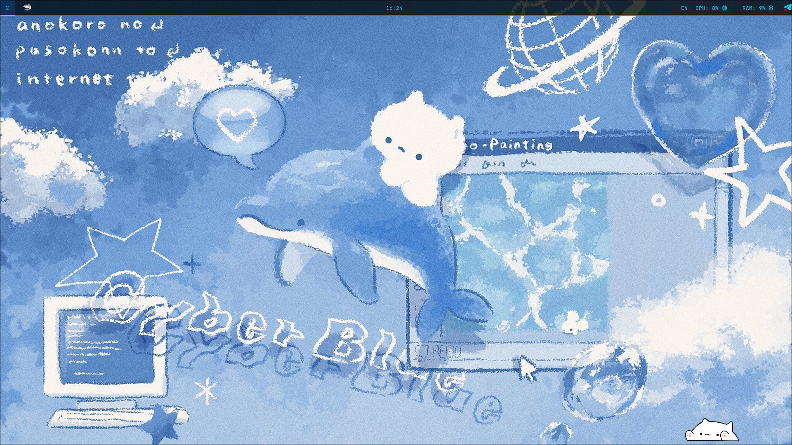
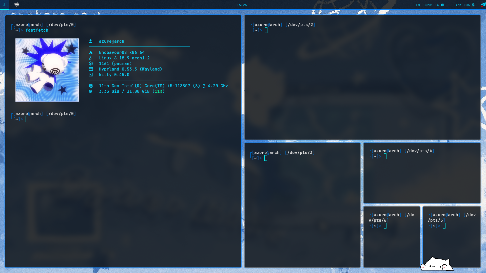
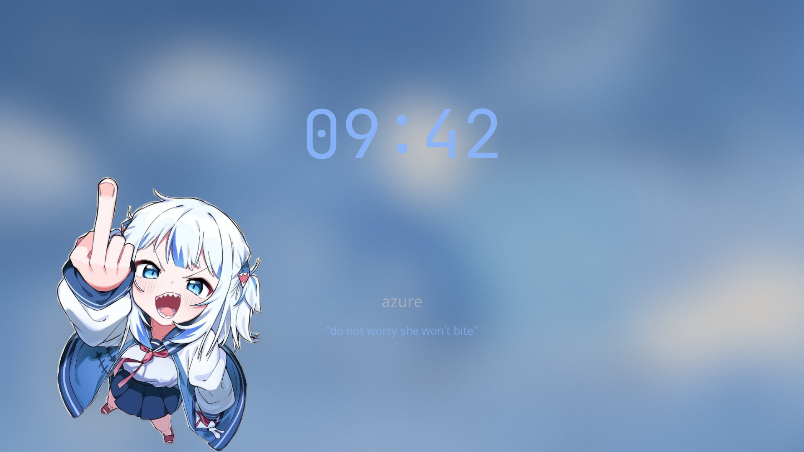
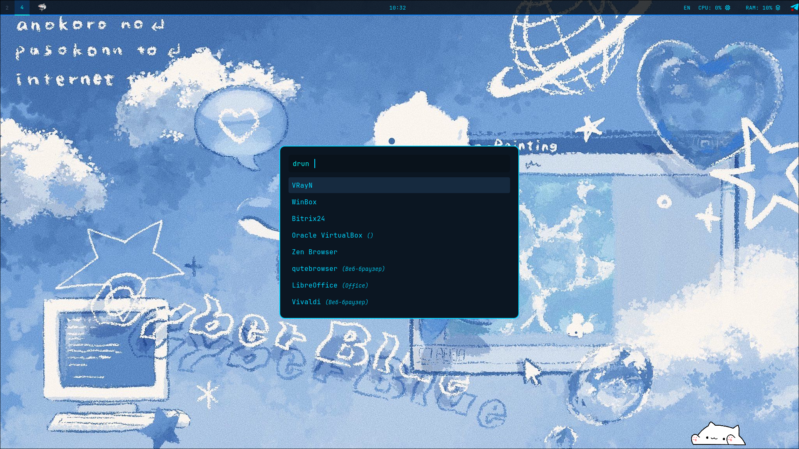

# Basic blue themed rice! 

My first rice based on **EndeavourOS**. Aslo my first repo

## Pics
>   
>  
>  
>  

## Stuff
- **OS:** EndeavourOS (Arch-based)
- **WM:** [Hyprland](https://hyprland.org/) (Wayland)
- **Bar:** Waybar
- **Terminal:** Kitty
- **Shell:** Zsh 
- **Runner:** Rofi
- **Lock screen:** Hyprlock
- **Notifications:** Mako

## Hotkeys

| Key | Action |
|---------|----------|
| `SUPER + Q` | Open terminal |
| `SUPER + C` | Close window |
| `SUPER + E` | File manager |
| `SUPER + R` | Rofi (apps) |
| `SUPER + B` | Browser (Zen) |
| `SUPER + L` | Lock screen (Hyprlock) |
| `SUPER + Print` | Make screenshot to clip |
